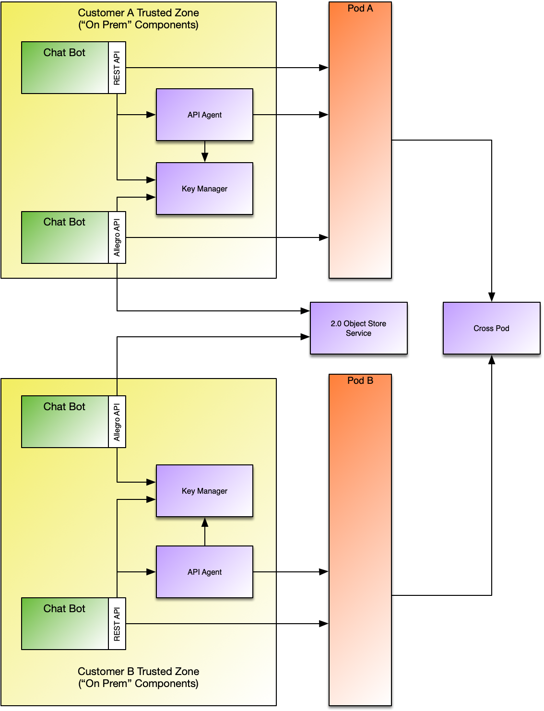

# Allegro Api
Allegro is a client side Java native binding for Symphony. By native binding we mean that it is implemented in Java and has encryption and decryption capabilities built in, so that an API Agent is not needed for its use.

Allegro can talk to a Symphony Pod and its associated Key Manager, and also the Symphony 2.0 Object Store, which
is a multi-tenant fully encrypted cloud storage service.

Bots using the Symphony REST API interact with the Key Manager to authenticate, and then the API Agent
to send and receive messages and the Pod to perform operations which do not involve encryption and
decryption (such as user provisioning).

The API Agent then interacts with the Key Manager on the bot's behalf, to obtain content enctryption keys
as necessary, and the pod to submit and receive messages, as a proxy (intermediary) for the bot.

The Allegro API interacts directly with the Key Manager to obtain content keys and the Pod to submit and
receive messages, and can also interact directly with the Object Store for non-chat related applications.

Access to the Object Store API is controlled by a Pod level entitlement, if your Pod is not configured for
this service then all requests will fail with an HTTP 403 error and the message "This feature is disabled for your pod."

All objects stored in the Object Store via the Allegro API are encrypted with the content key for a Symphony thread (conversation). 
This means that a caller of the Allegro API must associate any stored object with a threadId (conversation), access
to that object requires physical access to the encrypted object (which is controlled by Object Store entitlements) 
as well as access to the content key for that thread,
which the Key Manager will only provide to callers who are a member of the conversation.

The objective of Allegro is to provide a means for bots and extension applications to store state
safely in the cloud, the API does not provide all of the capabilities of the [Symphony REST API](https://developers.symphony.com/restapi/reference) which
may be a more appropriate solution for some use cases.
